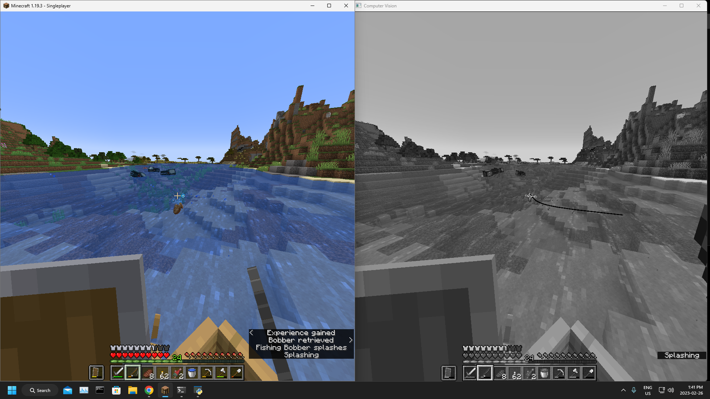

# Minecraft Fishing Bot

A bot that can automatically fish in Minecraft.



## Python Version

This project was developed using Python 3.10.10.

## Install Tesseract

The fishing bot depends on Tesseract, which is an optical character recognition (OCR) engine that is used to convert scanned images of machine-printed and handwritten text into digital text. You can find the latest version [here](https://github.com/UB-Mannheim/tesseract/wiki).

Make sure to specify the path to `tesseract.exe` in `main.py`.

## Install Dependencies

Install the necessary dependencies.

```text
pip install -r requirements.txt
```

## How To Use

Just run `main.py` and have it running in the background.

## Things To Note

Subtitles need to be turned on for it to work.

It does not work in full screen.

Set keyboard focus on the computer vision window and press "q" to quit.

It messes up when multiple people are fishing in the same spot because it reads other subtitles.

Make sure you don't have Minecraft minimised when you start the script.
